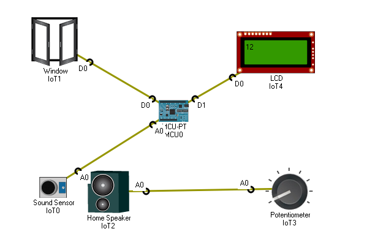

# Projetos_PacketTracer
<h3>Cenário 1:</h3>

Neste projeto o intuito foi utilizar o componente Sound Sensor para que assim pudesse fechar a janela se o volume do som ultrapasse 50...

<h3>Cenário 2:</h3>

Neste projeto o intuito foi desenvolver um alarme de incêndio a medida que a temperatura aumentasse gradativamente...

<h3>Projeto MCU:</h3>

Neste projeto o intuito foi desmonstrar a implementação de dois MCU´s interligados para controlar LED´s

<h3>Smoke Sensor:</h3>

Neste projeto o intuito foi utilizar o smoke sensor para medir o volume de fumaça no ambiente e, consequentemente, poder abrir uma janela.

<h3>Trabalho Final:</h3>

Neste projeto o intuito foi desenvolver um sistema de alarme por meio de sensores de movimento...

